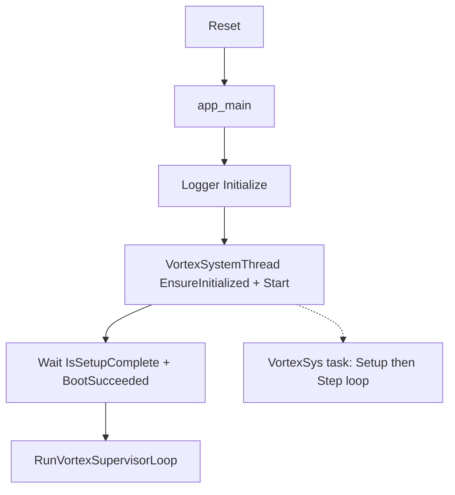

# Boot flow and orchestration

This document traces execution from chip reset through **orchestrator setup complete** and into the supervisor.

## 1. `app_main` (`app_main.cpp`)

Sequence (simplified):

1. **`Logger::GetInstance().Initialize()`** — logging before other subsystems speak.
2. **`VortexSystemThread::GetInstance()`** — reference to the orchestrator singleton.
3. **`EnsureInitialized()`** — creates the underlying `BaseThread` (FreeRTOS task stack for **VortexSys**). Failure → fatal log + delayed `esp_restart()`.
4. **`Start()`** — starts the thread so `Setup()` runs on the orchestrator task (not on main). Failure → restart.
5. **Wait for setup** — `TestLogicWithTimeout(..., orch.IsSetupComplete(), ..., ComputeVortexBootTimeoutMs(), ...)`  
   - `ComputeVortexBootTimeoutMs()` is **120000 ms** (two minutes) in `VortexSystemThread.h`.
6. **`BootSucceeded()`** — must be true after `Setup()`; false → restart.
7. **`RunVortexSupervisorLoop(Vortex::GetInstance(), orch)`** — **does not return** under normal operation.

### Fatal path

`ResetWithDiagnostic(reason)` logs at error level, waits **2 s**, then `esp_restart()`.

## 2. `VortexSystemThread` (`BaseThread`)

### Thread parameters (from header)

- **Name**: `"VortexSys"` (tag for logs is separate: `VortexSys`).
- **Stack**: **16384** bytes internal buffer, passed to `CreateBaseThread`.
- **Priority**: **5** (`OS_Uint`).
- **Dispatch period**: **`Step()`** return value **100 ms** (`kDispatchPeriodMs`).

### `Setup()` — boot table

`Setup()` clears state, then walks **`kInitSequence`** in order:

| Step name | `recoverable` | Behavior |
|-----------|---------------|----------|
| `vortex_hal` | **no** | `Vortex::GetInstance().EnsureInitialized()`; on failure → transition **Fault**, teardown completed steps, `Setup()` returns false. |
| `ws2812` | **yes** | Start `WS2812TestThread`; failure logs warning, boot **continues**. |
| `canopen_bldc` | **yes** | If `CommChannelsManager::GetInstance().GetCanOpenBus()` is null → skip (returns false, not fatal). Else construct `CANOpenBLDCThread(nodeId, *pcan)`, init, start; on failure reset pointer and continue. |

On full success, state machine transitions to **`Ready`**, `boot_succeeded_ = true`.

### `TeardownThrough`

On failure of a **non-recoverable** step, or in `Cleanup()`, teardown runs **reverse order** from `last_completed_step_` down to **0**, calling each step’s `teardown` if non-null.

### `Step()` — steady state

Every **600** ticks of `Step()` (~60 s at 100 ms/tick), if CANopen BLDC thread is running, logs a one-line motor status (present, enabled, position, velocity).

## 3. `VortexSystemStateMachine`

States (`VortexSystemState`):

- `Boot`, `HalInit`, `ThreadsUp`, `Ready`, `Fault`

`TryTransition` in the current implementation **stores** the new state and reason (no guard table); init code calls it at milestones for observability. **`StateName()`** returns a C string for logs.

### Where transitions are triggered

- **`SetupVortexHal`**: `HalInit` after begin (and implicit boot).
- **`SetupCanOpenBldc`**: `ThreadsUp` before starting the BLDC thread.
- **`Setup()`** success: `Ready`.
- **Failed non-recoverable step** or **`Cleanup()`**: `Fault`.

## 4. Synchronization contract for `app_main`

- **`IsSetupComplete()`** / **`BootSucceeded()`** are defined on the orchestrator (see `VortexSystemThread` / `BaseThread` implementation in HAL utils) so the main task can block until the **orchestrator’s `Setup()`** finished without polling HAL init directly.
- After that, **HAL is already initialized** and selected workers are running before the supervisor touches `Vortex` for demos.

## Diagram (high level)

For supervisor timing and demos, see [supervisor-loop.md](supervisor-loop.md).
